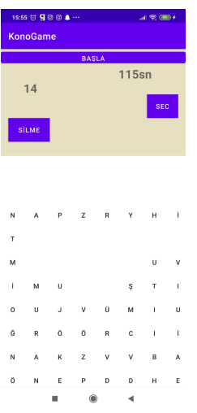

# Word Game
This Android app is a simple word game inspired by Tetris. The game involves dropping random letters from above and the player's goal is to form meaningful words by clicking on the falling letters. When a word is formed correctly, the player earns points and the letters disappear from the grid. The game continues at a certain pace, increasing as the player's score increases. The game ends when the letters reach the top of the grid. Players can pause and resume the game at any time. The highest score achieved by the player is recorded and displayed.

